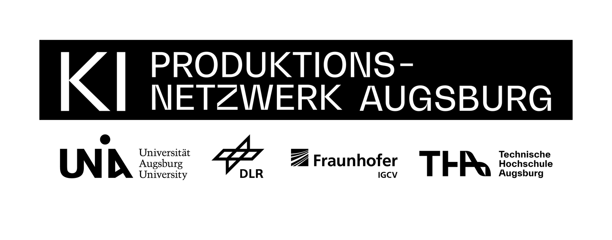

# soar_ros: A ROS 2 Interface for Soar

This ROS2 package provides an interface for the Soar cognitive architecture by
creating wrappers for ROS2 messages and handling the Soar kernel in
a [continuos mode](https://soar.eecs.umich.edu/development/soar/ThreadsInSML/).

[Soar](https://soar.eecs.umich.edu/) is a cognitive architecture developed at
the University of Michigan. It is used in the field of cognitive robotics in
different projects, e.g. a
[drone](https://github.com/saikishor/soar-to-ros/tree/master) or a
[robot](https://github.com/pauloserrafh/ros_tiago_soar/tree/master). However,
the integration of Soar and [ROS 2](https://www.ros.org/) is currently difficult
for complex projects, which include multiple publishers, subscribers, services
or clients. The main limitation orginates from the synchronous callback model
used by Soar which inspired the creation of this wrapper. A detailed explanation
about the reason for the development of the package can be read in the
[software architecture](./doc/SoftwareArchitecture.md).

The package relies on a forked version of Soar. The major changes include a
`cmake`-based build instead of `scons` and removal of SWIG language interfaces.
For a detailed comparison have a look at the commit history of the
[fork](https://github.com/moschmdt/soar).

## Features

The library is developed targeting ROS 2 Humble on Ubuntu 22.04. Other
configurations were not tested. It provides

- Non blocking Soar kernel
- Publisher
- Subscriber
- Service
- Client

The following features are **not supported**, yet.

- Action Server and Client
- Multiple Soar agents

## Definition and description of the public API

The API documentation is generated via [`rosdoc2`][rosdoc], cf.
[how to build documentation](#how-to-build-documentation).

## Examples

The following examples are an extract of the test cases in
[test/test_soar_ros.cpp](./test/test_soar_ros.cpp).

### Publisher

The `soar_ros::Publisher` extends the ROS `Publisher` so the user only needs to
define how data are converted between ROS data types and Soar data types.

```cpp
class TestOutput : public soar_ros::Publisher<std_msgs::msg::String>
{
public:
  TestOutput(sml::Agent * agent, rclcpp::Node::SharedPtr node, const std::string & topic)
  : Publisher<std_msgs::msg::String>(agent, node, topic) {}
  ~TestOutput() {}
  std_msgs::msg::String parse(sml::Identifier * id) override
  {
    std_msgs::msg::String msg;
    msg.data = id->GetParameterValue("data");
    std::cout << id->GetCommandName() << " " << msg.data << std::endl;
    return msg;
  }
};
```

### Service

In the following example, the ROS2 example `AddTwoInts` is implemented. Soar adds
two integers and sends the result as a ROS2 Service, based on the
`soar_ros::Service` class. The code is from
[test/test_soar_ros.cpp](./test/test_soar_ros.cpp).

```cpp
class TestService : public soar_ros::Service<example_interfaces::srv::AddTwoInts>
{
public:
  TestService(sml::Agent * agent, rclcpp::Node::SharedPtr node, const std::string & topic)
  : Service<example_interfaces::srv::AddTwoInts>(agent, node, topic) {}
  ~TestService() {}

  example_interfaces::srv::AddTwoInts::Response::SharedPtr parse(sml::Identifier * id) override
  {
    example_interfaces::srv::AddTwoInts::Response::SharedPtr response =
      std::make_shared<example_interfaces::srv::AddTwoInts::Response>();
    auto sum = id->GetParameterValue("sum");
    int32_t num = std::stoi(sum);
    response.get()->sum = num;
    RCLCPP_INFO(m_node->get_logger(), "Computed: Sum=%ld", response.get()->sum);
    std::cout << "Sum=" << response.get()->sum << std::endl;
    return response;
  }

  void parse(example_interfaces::srv::AddTwoInts::Request::SharedPtr msg) override
  {
    sml::Identifier * il = getAgent()->GetInputLink();
    sml::Identifier * pId = il->CreateIdWME("AddTwoInts");
    pId->CreateIntWME("a", msg.get()->a);
    pId->CreateIntWME("b", msg.get()->b);
  }
}
```

A second step is required to actually make this interface available - adding it
to the node similar to a builder pattern, cf.
[tes_soar_ros.cpp](test/test_soar_ros.cpp).

```cpp
auto node = std::make_shared<soar_ros::SoarRunner>("Test Agent", soar_path);

std::shared_ptr<soar_ros::Service<example_interfaces::srv::AddTwoInts>> service =
    std::make_shared<TestService>(node.get()->getAgent(), node, "AddTwoInts");
node->addService(service);

node->startThread();

rclcpp::executors::MultiThreadedExecutor executor;
executor.add_node(node);
executor.spin();
```

These rules use an operator to add two integer numbers and provide the sum
at the output link. The following rules are availabe in
[main.soar](Soar/main.soar).

```soar
sp {any*propose*add_two_ints
   (state <s> ^io.input-link.AddTwoInts <pAddTwoInts>)
   -(<pAddTwoInts> ^status complete)
-->
   (<s> ^operator <o> + =)
   (<o> ^name add_two_ints
      ^pAddTwoInts <pAddTwoInts>)
}

sp {any*apply*add_two_ints
   (state <s> ^operator <o>
      ^io.output-link <ol>)
   (<o> ^name add_two_ints
   ^pAddTwoInts <pAddTwoInts>)
   (<pAddTwoInts> ^a <a>
      ^b <b>)
-->
   (<ol> ^AddTwoInts.sum (+ <a> <b>))
   (<pAddTwoInts> ^status complete)
}
```

## How to build and install

**Prerequisite**: A ROS2 installation is available.

1. Clone this repository in your workspace
1. Build via `colcon build --packages-select soar_ros`
1. Source the ROS workspace
1. Run the test executable via `ros2 run soar_ros test_example`. The output should
look similar to the following:

    ```shell
    $ ros2 run soar_ros test_example
    [INFO] [1721823668.516038530] [SoarRunner]: Starting runThread
    [INFO] [1721823668.516344554] [SoarRunner]: Test Agent:      1:    O: O1 (init-agent)
    [INFO] [1721823668.516466911] [SoarRunner]: Test Agent:      2:    ==>S: S2 (state no-change)
    [WARN] [1721823669.516121281] [SoarRunner]: AddTwoIntsClient service not available, waiting again...
    ```

> [!WARNING]
> If you would like to use the Java-based debugger, the installation of the
> official Soar release is requried:
> Download and install the latest Soar release from their
> [repository][soar_repo]. Setting the `SOAR_HOME` environment variable to
> the `bin/` directory of the insalltion could help to open the debugger.

## How to build and run tests

The packages relies on the `colcon test` procedure, including launch testing
which is automatically triggered by `colcon test`.

```shell
colcon test
colcon test-result --verbose
```

## How to build documentation

The documentation is generated via [`rosdoc2`][rosdoc]. Execute the following
commands in the cloned repository or adjust the path of `rosdoc2 build`
accordingly.

```shell
rosdoc2 build --package-path .
rosdoc2 open docs_output/soar_ros/index.html
```

## How to develop

Clone the package in your ROS2 workspace.

## Usage

Include this package as dependency in your `CMakeLists.txt` and clone it your
ROS2 workspace.

```cmake
find_package(soar_ros REQUIRED)
ament_target_dependencies(<executable_name> soar_ros)
```

For code references have a look at the [examples](#examples).

## License

Licensed under the Apache License, Version 2.0 (the "License");
you may not use this file except in compliance with the License.
You may obtain a copy of the License at

<http://www.apache.org/licenses/LICENSE-2.0>

Unless required by applicable law or agreed to in writing, software
distributed under the License is distributed on an "AS IS" BASIS,
WITHOUT WARRANTIES OR CONDITIONS OF ANY KIND, either express or implied.
See the License for the specific language governing permissions and
limitations under the License

Refer to the [license](LICENSE) file. The respective Soar license is available
at their [repository][soar_repo].

## Acknowledgements

This project was developed as part of the [AI Production Network
Augsburg](https://www.kiproduktionsnetzwerk.de/) funded by the [Bavarian State
Ministry of Science and the Arts](https://www.stmwk.bayern.de/englisch.html)
and the [Bavarian Ministry of Economic Affairs, Regional Development and
Energy](https://www.stmwi.bayern.de/english/).




[Imprint](https://www.tha.de/Service/Impressum.html) & [privacy](https://www.tha.de/Service/Datenschutz.html)

[rosdoc]: https://github.com/ros-infrastructure/rosdoc2
[soar_repo]: https://github.com/SoarGroup/Soar
