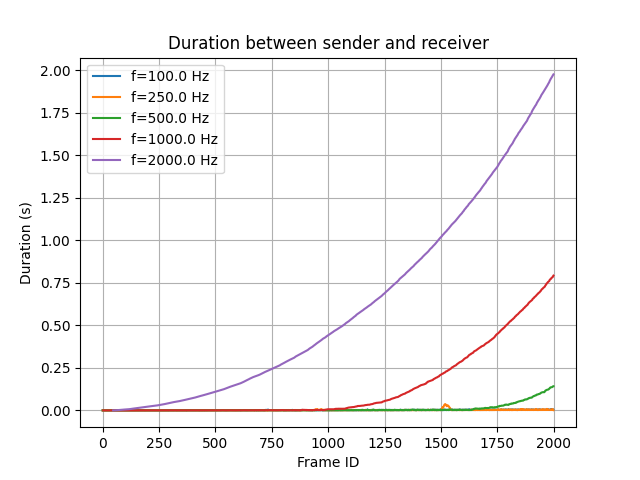
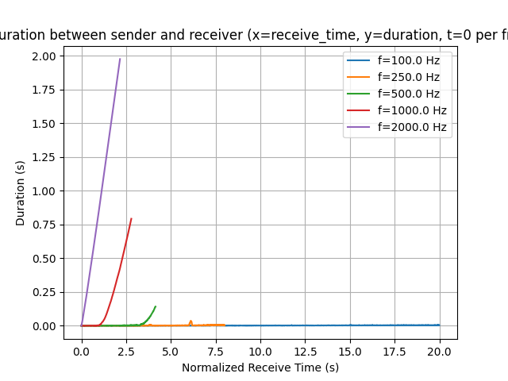

# Benchmark Test Documentation

## 1. Scope

This benchmark evaluates the message passing performance and reliability of the
soar_ros system using ROS 2. It measures the latency and consistency of header
message delivery between a sender and receiver node at various frequencies, and
checks for dropped or out-of-order messages.

## 2. Setup

- ROS 2 nodes: Sender, Receiver, System
- Sender publishes `std_msgs::msg::Header` messages to the `input` topic at configurable frequencies.
- Receiver subscribes to the `output` topic and logs received messages with timestamps.
- System node processes messages.
- The number of messages sent per run is configurable.
- The setup can be used for SISO and MIMO tests via multiple channels (n).

## 3. How to run

See instructions in [evaluation.ipynb](../test/benchmark/evaluation.ipynb).

## 4. Results

- The evaluation script produces:
  - Latency plots: duration between sender and receiver vs. frame_id and vs. time.
  - Message order plots: derivative of frame_id series to check for consistency.
  - Dropped message report: lists any missing frame_ids.
- Use these results to assess system performance at different message rates and
identify bottlenecks or reliability issues.

## 5. Relevant Files

- [Sender.cpp](../test/benchmark/Sender.cpp): Publishes header messages at a configurable frequency to the input topic.
- [Receiver.cpp](../test/benchmark/Receiver.cpp): Subscribes to the output topic and logs received header messages with timestamps.
- [System.cpp](../test/benchmark/System.cpp): The soar_ros system under test, processes input and output messages.
- [benchmark.launch.py](../launch/benchmark.launch.py): Launch file to start sender, receiver, and system nodes with configurable parameters and logging.
- [benchmark.sh](../test/benchmark/benchmark.sh): Shell script to automate running the benchmark for multiple frequencies and run IDs.
- [parse-logs.py](../test/benchmark/parse-logs.py): Python script to parse log files for analysis in a Jupyter notebook.
- [evlauation.ipynb](../test/benchmark/evaluation.ipynb): Analysis tool for benchmark data.
- [benchmark.soar](../Soar/benchmark.soar): Soar rules for message handling and status marking in the system under test.