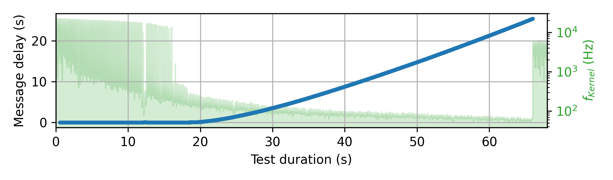
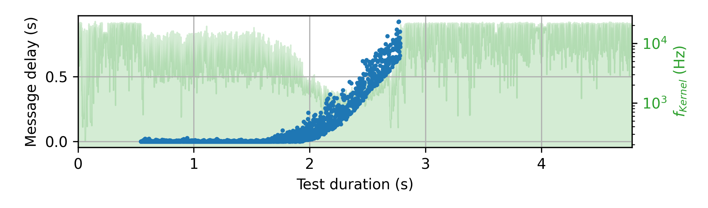
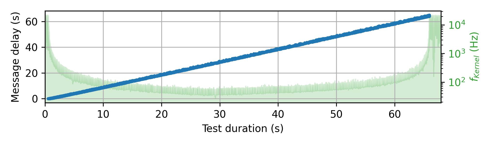

# Benchmark Test Documentation

> [!NOTE]
> **Publication:** The performance evaluation described here has been accepted
> for publication at **SOHOMA 2026** (International Workshop on Service
> Orientation in Holonic and Multi-Agent Manufacturing).

## 1. Scope

This benchmark evaluates the message passing performance and reliability of the
soar_ros system using ROS 2. It measures the latency and consistency of header
message delivery between a sender and receiver node at various frequencies, and
checks for dropped or out-of-order messages.

## 2. Setup

- ROS 2 nodes: Sender, Receiver, System
- Sender publishes `std_msgs::msg::Header` messages to the `input` topic at
configurable frequencies.
- Receiver subscribes to the `output` topic and logs received messages with timestamps.
- System node processes messages.
- The number of messages sent per run is configurable.
- The setup can be used for SISO and MIMO tests via multiple channels (n).


```mermaid
flowchart LR
    Sender --n--> System --n--> Receiver
```

### Test setups

The evaluation runs the same forwarding system under test in several
configurations, each isolating a different performance aspect:

- **No auto-delete (baseline):** 200 Hz, 8000 messages, automatic IOL cleanup
  disabled — shows the `O(n)` delay growth from accumulating input/output-link
  elements.
- **Auto-delete:** 200 Hz, 8000 messages, automatic IOL cleanup enabled —
  isolates the effect of removing completed messages each decision cycle.
- **Kernel frequency (no load):** no messages — measures the unloaded Soar
  decision cycle frequency that bounds throughput.
- **Maximum throughput (SISO):** 4000 messages at 2500 Hz and 3000 Hz,
  auto-cleanup enabled — locates the throughput threshold (~2500 Hz) above
  which the kernel throttles.
- **Preference (FIFO):** 100-message bursts at 2500 Hz and 3000 Hz, auto-cleanup
  enabled — measures the overhead of enforcing FIFO order via Soar operator
  preferences.
- **Profiling:** 100 messages at 1 Hz under Valgrind/KCachegrind — attributes
  runtime cost between the Soar kernel and the `soar_ros` integration layer.

All runs use a multi-threaded executor for the system under test and a reliable
QoS profile so no messages are lost.

## 3. How to run

1. Enable the `BUILD_BENCHMARK` CMake option so the `Sender`, `Receiver`, and
   `System` executables are built (it is `OFF` by default):

   ```bash
   colcon build --cmake-args -DBUILD_BENCHMARK=ON
   ```

2. Install the Python packages used for log parsing and plotting. They are
   declared in [pyproject.toml](../pyproject.toml) (notably `pandas` and
   `matplotlib`) and can be installed with [uv](https://docs.astral.sh/uv/):

   ```bash
   uv sync
   ```

3. Source the workspace and run the benchmark script, which executes all test
   cases unattended, parses the logs, and generates the evaluation plots:

   ```bash
   ./test/benchmark/benchmark.sh
   ```

The preferences-based scenario requires the `benchmark-preferences` branch; see
the note in [benchmark.sh](../test/benchmark/benchmark.sh).

## 4. Results

For each run the evaluation script produces latency plots (message duration
between sender and receiver alongside the Soar kernel frequency vs. relative
time), input-frequency comparisons across scenarios, kernel-frequency
distributions under load and at idle, and a report of any dropped frame_ids. The
full set of plots is written to [doc/Images](./Images/); the key findings are
summarized below.

### Effect of automatic IOL cleanup

Without automatic input/output-link (IOL) cleanup, completed messages accumulate
on the links. Because the links are traversed as lists (`O(n)`), the per-cycle
cost grows with the backlog, so the message delay climbs steadily once the
backlog builds and only recovers after the input drains.



Enabling automatic cleanup removes the correlation between message count and
delay. The system sustains 200 Hz with only sporadic delay spikes (e.g. from OS
scheduling). The remaining plots in this scenario
(`auto_delete_200_Hz_*`) confirm the flat delay profile.

### Maximum throughput (SISO)

With cleanup enabled, throughput was probed by raising the sender frequency. At
~2500 Hz the system keeps up with only minor, recoverable delays:



At ~3000 Hz it is overwhelmed: although the sender finishes in ~1.3 s, the kernel
throttles and total processing stretches to ~65 s. This locates the practical
throughput ceiling at roughly 2500 Hz on the test hardware.



The companion plot `SISO_Input_Frequency_Comparison.png` (delay vs. frequency)
details this transition. The varying delays stem from the agent randomly
selecting unprocessed inputs, i.e. ordering is not FIFO.

### Kernel frequency distribution

Without load the mean Soar kernel frequency is ~18 kHz. Under load the
distribution shifts toward lower frequencies; at 3000 Hz roughly 6 % of cycles
fall into the very-low range, the signature of exceeding the throughput ceiling.
Compare `kernel_frequency_comparison_no_load.png` with
`kernel_frequency_comparison_siso.png`.

### Preference-based (FIFO) ordering

FIFO ordering can be enforced via Soar operator preferences ranked by message
timestamp. This is cheap for short 2500 Hz bursts but collapses at 3000 Hz,
where kernel frequency drops sharply and delay grows roughly linearly. Operator
preferences are therefore unsuitable for high-throughput prioritization — handle
priority through QoS or preprocessing instead. See
`Preference_including_*_Hz_*.png` and
`preference_enabled_Input_Frequency_Comparison.png`.

## 5. Relevant Files

- [Sender.cpp](../test/benchmark/Sender.cpp): Publishes header messages at a
configurable frequency to the input topic.
- [Receiver.cpp](../test/benchmark/Receiver.cpp): Subscribes to the output topic
and logs received header messages with timestamps.
- [System.cpp](../test/benchmark/System.cpp): The soar_ros system under test,
processes input and output messages.
- [benchmark.launch.py](../launch/benchmark.launch.py): Launch file to start
sender, receiver, and system nodes with configurable parameters and logging.
- [benchmark.sh](../test/benchmark/benchmark.sh): Shell script to automate
running the benchmark for multiple frequencies and run IDs.
- [parse-logs.py](../test/benchmark/parse-logs.py): Python script to parse log
files for analysis in a Jupyter notebook.
- [evaluation.py](../test/benchmark/evaluation.py): Analysis script for
benchmark data.
- [benchmark.soar](../Soar/benchmark.soar): Soar rules for message handling and
status marking in the system under test.
